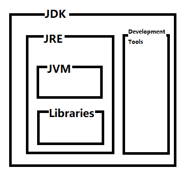

# Java基础

## Java概述

Java是一种通用的计算机编程语言，具有并发、基于类、面向对象、少依赖性等特点。它旨在让开发人员“write
once, run 
anywhere，编写一次，随处运行”（WORA），这意味着编译的Java代码可以在支持Java的所有平台上运行，而无需重新编译。

例如，你在Linux上编写和编译Java程序，可以在
Windows，Mac或Linux计算机上直接运行，而不需要对源代码进行任何修改。WORA通过将Java程序编译成**字节码**。然后Java虚拟机（
Java Virtual Machine，JVM）在各个平台上运行编译好的字节码。

## Java常见概念

当人们谈论Java时，他们经常会提到总体概念的几个不同部分。这是因为Java不仅仅是一种编程语言。对于一个初学者来说，所有这些不同的“含义”可能会令人困惑，所以这里将简要解释它们，以便你知道人们在谈论什么。与Java相关的最常见概念是：

- [Java语言](#Java语言)
- [Java字节码](#Java字节码)
- [Java虚拟机（JVM）](#Java虚拟机（JVM）)
- [Java API](#JavaAPI)
- [Java运行时环境（JRE）](#Java运行时环境（JRE)
- [Java开发人员工具包（JDK）](#Java开发人员工具包（JDK）)
- [Java代码约定](#Java代码约定)
- [Java标准版（JSE）](#Java标准版（JSE）)
- [Java企业版（JEE）](#Java企业版（JEE）)
- [Java应用服务器](#Java应用服务器)
- [Java Micro Edition（JME）](#JavaMicroEdition（JME）)
- [Java小程序](#Java小程序)
- [JavaFX的](#JavaFX的)
- [Java开发者社区](#Java开发者社区)

### Java语言
首先，Java是一种编程语言。这意味着存在一种Java语言规范，它明确地告诉哪些元素是Java语言本身的一部分。换句话说，Java语言能够做什么。
Java文件存储在后缀为的文件中.java 。然后使用Java编译器将这些文件编译为Java字节代码，然后使用Java虚拟机（JVM）执行字节代码。Java编译器和JVM是Java Development Kit的一部分。

### Java字节码
用Java语言编写的Java程序被编译成Java字节码，可以由Java虚拟机执行。Java字节码存储在二进制.class文件中。

### Java虚拟机（JVM）
Java是一种解释型语言。那是什么意思？好吧，Java语言被编译成Java字节码。然后，Java虚拟机将执行此Java字节码。
Java虚拟机就像一台计算机。它可以执行Java字节码，就像PC可以执行汇编指令一样。
Java虚拟机适用于多种不同的操作系统，如Windows，Mac
OS，Linux，IBM大型机，Solaris等。因此，如果您的Java程序可以在Windows上的Java虚拟机上运行，​​它通常也可以在Java上运行Mac
OS或Linux上的虚拟机。有时，操作系统特定的问题会使您的应用程序的行为不同，但大多数时候它们的行为非常相似。Sun将此称为“一次编写，随处运行”。
Java虚拟机本身就是一个程序。您启动JVM并告诉它要执行的Java代码。这通常通过命令行界面（CLI）完成，例如bash或Windows中的命令行界面。在命令行中，您告诉JVM要执行的Java类（字节码）。

### Java API
Java语言使您能够将用Java语言编写的组件打包到API（应用程序编程接口）中，这些API可供其他人在Java应用程序中使用。Java捆绑了很多这样的组件。这些组件称为标准Java
API。这些API使您的Java程序能够访问本地文件系统，网络和许多其他内容。
标准Java
API提供了许多基本功能，否则您必须自己编程。因此，API可帮助您更快地开发应用程序。
标准Java API可供所有Java应用程序使用。标准Java API与Jav​​a运行时环境（JRE）或Java SDK（包括JRE）捆绑在一起。

### Java运行时环境（JRE）
Java运行时环境（JRE）是Java虚拟机和Java标准版（JSE）附带的标准Java API。JRE包含足以执行Java应用程序，但不能编译它。

### Java开发人员工具包（JDK）
Java软件开发工具包（Java SDK）是JRE加Java编译器和一组其他工具。

如果您需要开发Java程序，则需要完整的Java
SDK。那时JRE是不够的。只有完整的Java
SDK包含Java编译器，它将.java源文件转换为字节代码 .class文件。
另外，一些Java服务器可能需要JDK中的一些工具来例如将JSP（Java Server Pages）编译成Java字节代码。在这种情况下，使用JRE运行服务器是不够的。您必须使用完整的Java SDK，以便服务器可以使用Java SDK中的额外工具。

### Java代码约定
Java代码约定是一组关于如何格式化Java代码以及如何命名类，变量，文件等的约定。大多数情况下，您不必遵循这些约定，但大多数开发人员都遵循大多数约定。

### Java标准版（JSE）
- Java已经演变成三组不同的API，或称为“配置文件”，有些人喜欢称它们：
- 适用于桌面和独立服务器应用程序的Java Standard Edition。
- 用于开发和执行嵌入Java服务器的Java组件的Java Enterprise Edition。
- 用于在移动电话和嵌入式设备上开发和执行Java应用程序的Java Micro Edition。
- Java Standard Edition包含用于独立桌面和命令行应用程序的基本Java API。Java Standard Edition有JRE和JDK。

### Java企业版（JEE）
Java Enterprise Edition包含许多用于在Java Enterprise
Server中执行Java组件的额外工具和API。企业Java组件的示例如下：
- Servlet的
- Java服务器页面（JSP）
- Java Server Faces（JSF）
- 企业Java Bean（EJB）
- 两阶段提交事务
- Java消息服务消息队列API（JMS）
- 等等

### Java应用服务器
Java Enterprise Edition只是一个规范。像IBM，Oracle等软件供应商可以自由地实现此规范。他们有。它们的实现通常称为Java应用程序服务器，因为服务器能够运行Java应用程序，同时为这些Java应用程序提供了大量标准化服务。

### Java Micro Edition（JME）
Java Micro Edition是针对PDA和移动电话等小型和嵌入式设备的Java版本。
今天（2015年），最流行的手机开发Java平台是谷歌的Android平台。顺便说一句，Android不使用Java Micro Edition。它使用自己的Java子集以及许多Android特定组件（API）。

### Java小程序
Java Applet是一个在Web浏览器中下载和执行的Java程序。因此，Java
Applet可以是Web应用程序的一部分。
当Java首次发布时，Applets是Java的主要卖点。但是现在Java
Applets几乎消失了（除了流行的游戏Minecraft）。HTML5和JavaScript已经成为在浏览器中执行代码的最佳方式。
今天，大多数Java开发人员在服务器端，Java应用程序服务器或其他服务器端平台（如Vert.x或Play框架）上进行开发。

### JavaFX的
JavaFX是一个RIA（富Internet应用程序）框架。它就像Java Applets，但具有更多功能，并且具有完全不同的GUI API。JavaFX的灵感来自Flex（Flash）和Silverlight for .NET（Microsoft）。

### Java开发者社区
Java开发人员社区由所有参与有关Java及其未来的辩论的Java开发人员组成。Java开发人员社区还开发了许多开源API和产品。