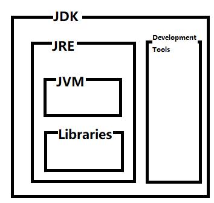

# Java基础

>Java语言是什么？

Java是一种通用的计算机编程语言，具有并发、基于类、面向对象、少依赖性等特点。它旨在让开发人员“write
once, run 
anywhere，编写一次，随处运行”（WORA），这意味着编译的Java代码可以在支持Java的所有平台上运行，而无需重新编译。

例如，你在Linux上编写和编译Java程序，可以在
Windows，Mac或Linux计算机上直接运行，不需要对源代码进行任何修改。WORA通过将Java程序编译成**字节码**。一个叫Java虚拟机（JVM）可以在每个平台上运行字节码。

